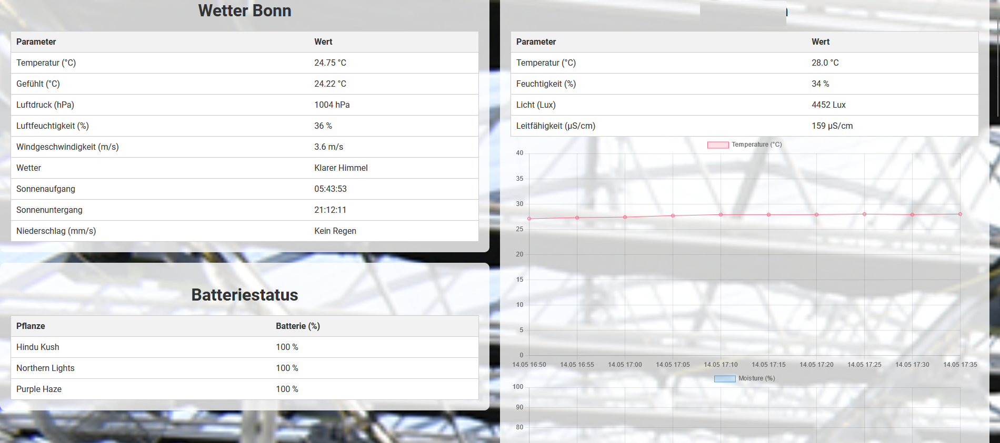
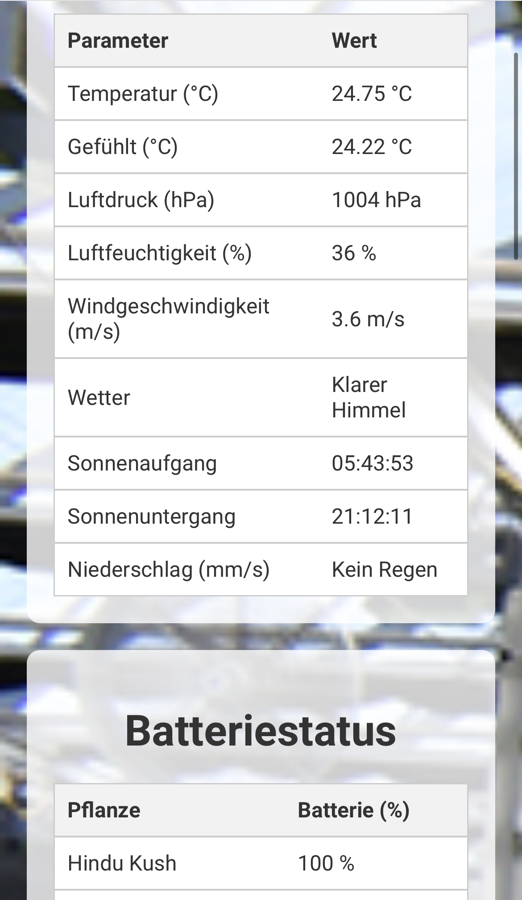

# Growcontrol
A simple plant care control website featuring Xiaomi HHCC sensors

This is my first Version of my small local Website that shows Weather Data for my Location and data from up to 3 Xiaomi HHCC Sensors in a nice and smooth way.

## How to use:
-Run the fetch_weather and getXdata.py as a cronjob. 
-Add the html file to your local Webserver 
-Make sure that all the relating Paths are correct.

### Adjustments

The following Lines need to get changed with your specific filepaths or names

Html file:
6
13
92
163
191
219
278
328
331
334

feth_weather.py:
5
9

getXdata.py:
65
69

I recomment to run this project on an Raspberry Pi 3 or any that has Bluetooth.

Nessesary librarys and Python librarys:
-Python 3
-bluez-tools
-pip miflora
-pip bluepy
-pip pygatt

To gather the initial Mac Adress of the HHCC Sensors you can run:
sudo hcitool lescan

Hardware used:
-Raspberry Pi 3 (https://amzn.to/3JXtcnT)
-3 Xiaomi HHCC Mi Flower Care Sensor (1 Sensor: https://amzn.to/4bhTuwS 3 Sensors: https://amzn.to/4bD5tVD)

**Note**: These links are Amazon affiliate links. If you use these links to buy something, i may earn a commission at no extra cost to you. Thank you for your support!

## Contributing

Feel free to contribute to this project by forking the repository and making a pull request...

## Pictures

